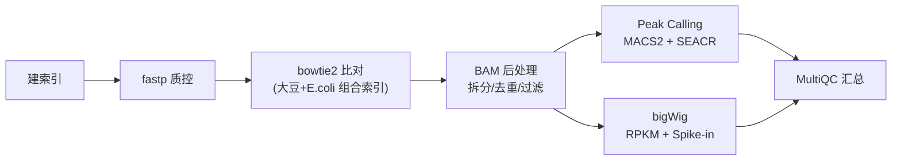

# CUT&Tag 数据分析 Pipeline — 大豆 Wm82

本项目提供了一套完整的 CUT&Tag 数据分析流程，适用于 （`csub` 作业调度系统）。分析对象为 **大豆 Wm82 参考基因组**，包含 **E. coli spike-in 标准化**。

## 📋 项目信息

| 项目 | 内容 |
|:----|:------|
| 物种 | 大豆 (Glycine max) Wm82 |
| 测序类型 | CUT&Tag, PE150 |
| 组蛋白修饰 | H3K27ac, H3K4me3, H3K9ac, H3K9me3 |
| 对照 | IgG（各 2 个生物学重复） |
| Spike-in | E. coli K12 |
| 集群 |  (csub 调度) |
| Conda 环境 | `CUT_Tag_env` |

## 📁 目录结构

```
scripts/cutandtag/
├── 00_config.sh              # 全局配置文件
├── 01a_download_ecoli.sh     # 处理 E.coli 参考基因组
├── 01_setup.sh               # bowtie2 建索引
├── 02_fastp_qc.sh            # fastp 质控过滤
├── 03_bowtie2_align.sh       # bowtie2 比对
├── 04_samtools_process.sh    # BAM 后处理（拆分/去重/过滤/统计）
├── 05_peak_calling.sh        # Peak Calling (MACS2 + SEACR)
├── 06_bigwig.sh              # bigWig 可视化文件生成
├── 07_multiqc.sh             # MultiQC 汇总报告
└── run_all.sh                # 主控脚本
```

## 🔧 环境要求

### 软件依赖

通过 conda 安装：

```bash
conda install -c bioconda fastp bowtie2 samtools sambamba
conda install -c bioconda macs2 seacr deeptools multiqc bedtools
```

### 参考基因组

- **大豆**: `Glycine_max_Wm82.genomic.fa`（染色体命名：Chr01 ~ Chr20）
- **E.coli**: 从 NCBI 下载 `GCF_000005845.2_ASM584v2_genomic.fna`，简化头行为 `>NC_000913`

## 🚀 执行流程

### 流程图



### 0. 配置文件说明

`00_config.sh` 中已预设好所有路径和参数，一般情况下**无需修改**。如需调整，关键变量：

| 变量 | 说明 |
|:----|:------|
| `BASE_DIR` | 项目根目录 |
| `RAW_FASTQ_DIR` | 原始 FASTQ 所在目录 |
| `SOY_CHR_PREFIX` | 大豆染色体前缀（`Chr`） |
| `ECOLI_CHR_NAME` | E.coli 染色体名（`NC_000913`） |

### 1. 处理 E.coli 基因组

将已下载的 E.coli FASTA 头行简化为 `>NC_000913`，便于后续拆分 reads。

```bash
cd /path/to/scripts/cutandtag
bash run_all.sh download_ecoli
```

**输出：** `05.genomes/Ecoli/NC_000913.fa`

### 2. 建索引

合并大豆 + E.coli 基因组，构建 bowtie2 组合索引（**只需运行一次**）。

```bash
# 直接运行
bash run_all.sh setup

# 或提交到集群
csub -q cpu_tmp -n 24 -J setup < 01_setup.sh
```

**输入：** `Glycine_max_Wm82.genomic.fa` + `NC_000913.fa`
**输出：** `05.genomes/combined/Wm82_Ecoli.*.bt2`
**耗时：** 1-2 小时

### 3. 质控过滤 (fastp)

去除接头和低质量 reads。

```bash
# 全样本运行
bash run_all.sh fastp

# 单样本调试
bash run_all.sh fastp HH_25_H3K27ac 1
```

**输入：** `01.raw_data/CUT_Tagraw/*.fastq.gz`
**输出：**
- `01.raw_data/CUT_Tagraw/clean/*.fastq.gz` — clean 数据
- `CUT_Tag/qc/fastp/*.html` — QC 报告
**耗时：** ~15 分钟（10 个样本）

### 4. 比对 (bowtie2) ⭐ 最耗时

将 clean reads 比对到组合基因组（大豆 + E.coli），一次比对同时获得两个物种的 reads。

```bash
# ⭐ 建议每个样本单独提交到集群，并行运行
csub -q cpu_tmp -n 24 -J align_K27ac_1 < 03_bowtie2_align.sh HH_25_H3K27ac 1
csub -q cpu_tmp -n 24 -J align_K27ac_2 < 03_bowtie2_align.sh HH_25_H3K27ac 2
csub -q cpu_tmp -n 24 -J align_K4me3_1  < 03_bowtie2_align.sh HH_25_H3K4me3 1
csub -q cpu_tmp -n 24 -J align_K4me3_2  < 03_bowtie2_align.sh HH_25_H3K4me3 2
csub -q cpu_tmp -n 24 -J align_K9ac_1   < 03_bowtie2_align.sh HH_25_H3K9ac  1
csub -q cpu_tmp -n 24 -J align_K9ac_2   < 03_bowtie2_align.sh HH_25_H3K9ac  2
csub -q cpu_tmp -n 24 -J align_K9me3_1  < 03_bowtie2_align.sh HH_25_H3K9me3 1
csub -q cpu_tmp -n 24 -J align_K9me3_2  < 03_bowtie2_align.sh HH_25_H3K9me3 2
csub -q cpu_tmp -n 24 -J align_Igg_1    < 03_bowtie2_align.sh HH_25_Igg     1
csub -q cpu_tmp -n 24 -J align_Igg_2    < 03_bowtie2_align.sh HH_25_Igg     2
```

**比对参数：** `--local --very-sensitive-local -I 10 -X 700`
**输出：** `CUT_Tag/alignment/01_raw/*.bam`（混合 BAM）
**耗时：** 2-4 小时 / 样本

### 5. BAM 后处理

拆分大豆/E.coli reads → 排序 → 去重 → 过滤 → 统计 Spike-in 因子。

```bash
bash run_all.sh process
```

处理流程：

```
原始混合 BAM
    │
    ├── 大豆 BAM (Chr01~Chr20) → 排序 → 去重 → MAPQ≥10过滤 → ✅ 最终 BAM
    │
    └── E.coli BAM (NC_000913) → 计数 → 计算 Spike-in 因子
```

**输出：**

| 路径 | 文件 | 说明 |
|:----|:----|:------|
| `CUT_Tag/alignment/02_filt/` | `*.filt.bam` + `.bai` | **最终可用 BAM** |
| `CUT_Tag/alignment/03_ecoli/` | `*.ecoli.bam` | E.coli reads |
| `CUT_Tag/alignment/04_stats/` | `spikein_factors.txt` | Spike-in 因子 |
| `CUT_Tag/alignment/04_stats/` | `*.flagstat.txt` | 比对统计 |

**Spike-in 因子计算：**
```
E.coli 比例 = E.coli_reads / Total_reads
ScaleFactor = Total_reads / E.coli_reads
```

**耗时：** ~1 小时 / 样本

### 6. Peak Calling

使用 MACS2 和 SEACR 两种方法检测富集区域。

```bash
bash run_all.sh peaks
```

| 标记 | MACS2 模式 | SEACR |
|:----|:-----------|:------|
| H3K27ac | Narrow | ✓ |
| H3K4me3 | Narrow | ✓ |
| H3K9ac | Narrow | ✓ |
| H3K9me3 | Broad | ✓ |

所有样本使用 **IgG** 作为对照。

**输出：**
- `CUT_Tag/peaks/macs2/narrow/*.narrowPeak`
- `CUT_Tag/peaks/macs2/broad/*.broadPeak`
- `CUT_Tag/peaks/seacr/stringent/*.bed`
- `CUT_Tag/peaks/seacr/relaxed/*.bed`

**耗时：** 1-2 小时 / 样本

### 7. bigWig 生成

生成两种标准化方式的 bigWig 文件。

```bash
bash run_all.sh bigwig
```

| 类型 | 路径 | 用途 |
|:----|:-----|:------|
| **RPKM** | `CUT_Tag/bigwig/rpkm/*.bw` | 单样本 IGV 可视化 |
| **Spike-in** | `CUT_Tag/bigwig/spikein/*.bw` | 样本间定量比较 |

**耗时：** ~20 分钟 / 样本

### 8. MultiQC 汇总

整合所有 QC 报告。

```bash
bash run_all.sh multiqc
```

**输出：** `CUT_Tag/qc/multiqc/CUTandTag_multiqc_report.html`

## 📂 完整输出结构

```
CUT_Tag/
├── alignment/
│   ├── 01_raw/          ← 原始比对 BAM（混合）
│   ├── 02_filt/         ← ✅ 最终过滤 BAM（下游分析起点）
│   ├── 03_ecoli/        ← E.coli reads
│   ├── 04_stats/        ← flagstat + spikein_factors.txt
│   └── 05_logs/         ← bowtie2 日志
├── peaks/
│   ├── macs2/narrow/
│   ├── macs2/broad/
│   └── seacr/
├── bigwig/
│   ├── rpkm/
│   └── spikein/
└── qc/
    ├── fastp/
    └── multiqc/
```

## ⏱ 预计运行时间

| 步骤 | 耗时 | 并行度 |
|:----|:-----|:-------|
| 建索引 | 1-2h | 一次性 |
| fastp 质控 | ~15min | 10 样本一起 |
| bowtie2 比对 | 2-4h / 样本 | **10 样本并行** |
| BAM 后处理 | ~1h / 样本 | 可并行 |
| Peak calling | 1-2h / 样本 | 可并行 |
| bigWig | ~20min / 样本 | 可并行 |
| MultiQC | ~5min | 一次性 |

**总时间（10 样本并行）：约 4-8 小时**

## 📝 后续分析建议

完成标准流程后，可进行以下下游分析：

1. **IGV 可视化** — 下载 bigWig 文件到本地用 IGV 查看
2. **Peak 注释** — 使用 ChIPseeker (R) 注释 peak 到基因
3. **差异富集分析** — 使用 spike-in 标准化后的信号比较不同修饰
4. **足迹分析 (footprinting)** — 使用 TOBIAS 等工具分析转录因子结合
5. **整合分析** — 结合 RNA-seq 数据做多组学分析

## 📚 参考文献

- CUT&Tag 原始文献: Kaya-Okur et al., Nat Commun (2019)
- MACS2: Zhang et al., Genome Biol (2008)
- SEACR: Meers et al., Epigenetics & Chromatin (2019)
- deepTools: Ramírez et al., Nucleic Acids Res (2016)
